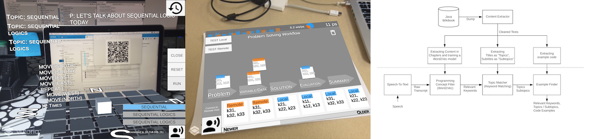

# AR Visualization for Conversation Topics

# Introduction

An AR app that can capture verbal communication, extract topics, and visualize the result in an AR image. 

The original purpose is to help the users organize concepts during brainstorming, or provide related examples when they are working together.
